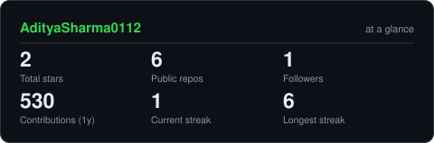
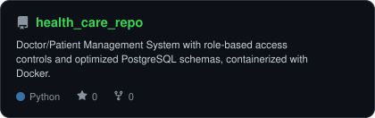
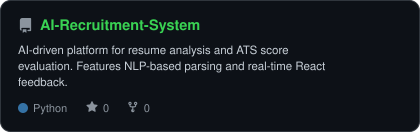
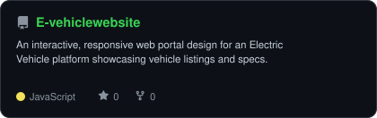
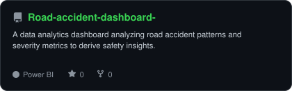

<div align="center">

<!-- PORTRAIT - generated by scripts/dotify.py from me.jpg.
     Colour mode, so one file serves both GitHub themes. Regenerate with:
       py scripts/dotify.py me.jpg -o assets/portrait \
         --cols 100 --equalize --detail 0.5 --color -->


<br>

<!-- NAME / TAGLINE - animated typing -->
<a href="https://github.com/AdityaSharma0112">
  
</a>

<br>

<!-- SOCIALS -->
<a href="https://linkedin.com/in/aditya-sharma-392bb71ba"></a>
<a href="mailto:aditya0112sharma@gmail.com"></a>


</div>

---

## `~/` whoami

```console
$ cat about.txt
```

Hi, I'm **Aditya Sharma**. I'm a Backend Developer specializing in Python, Django, and AI/ML pipelines. I build enterprise RAG workflows and optimize APIs for scale.

- Currently building **AI Evaluation & Analytics Platforms**
- LinkedIn: **[aditya-sharma-392bb71ba](https://linkedin.com/in/aditya-sharma-392bb71ba)**
- Learning **Multi-Agent Systems & Advanced Backend Architectures**
- Fun fact: **I started coding because I loved building tools to solve real-world problems.**

<br>

<div align="center">

## `~/` toolbox


</div>

---

<div align="center">

## `~/` skill radar

<table>
<tr>
<td width="50%" align="center" valign="middle">

<!-- Self-rated radar - edit assets/skills.json, the workflow redraws it -->
<picture>
  <source media="(prefers-color-scheme: dark)"  srcset="assets/radar-dark.svg">
  <source media="(prefers-color-scheme: light)" srcset="assets/radar-light.svg">
  
</picture>

</td>
<td width="50%" align="center" valign="middle">

<!-- Live radar built from real language byte counts across your repos -->
<picture>
  <source media="(prefers-color-scheme: dark)"  srcset="assets/radar-langs-dark.svg">
  <source media="(prefers-color-scheme: light)" srcset="assets/radar-langs-light.svg">
  
</picture>

</td>
</tr>
</table>

</div>

---

<div align="center">

## `~/` contribution calendar

<!-- 3D isometric calendar, regenerated every 6h by .github/workflows/metrics.yml -->


<br><br>

<!-- Snake eats the contribution graph - .github/workflows/snake.yml -->
<picture>
  <source media="(prefers-color-scheme: dark)"  srcset="https://raw.githubusercontent.com/AdityaSharma0112/AdityaSharma0112/output/snake-dark.svg">
  <source media="(prefers-color-scheme: light)" srcset="https://raw.githubusercontent.com/AdityaSharma0112/AdityaSharma0112/output/snake.svg">
  
</picture>

</div>

---

<div align="center">

## `~/` the numbers

<!-- Generated by scripts/cards.py into this repo. Deliberately NOT
     github-readme-stats / streak-stats / github-profile-trophy: those are
     shared public instances that go down and take the whole section with them. -->
<picture>
  <source media="(prefers-color-scheme: dark)"  srcset="assets/card-stats-dark.svg">
  <source media="(prefers-color-scheme: light)" srcset="assets/card-stats-light.svg">
  
</picture>

<br>


<br><br>


</div>

---

<div align="center">

## `~/` selected work

<!-- Cards generated by scripts/cards.py from assets/projects.json.
     Stars, forks and language are pulled live from the API on every run. -->
<table>
<tr>
<td width="50%">
  <a href="https://github.com/AdityaSharma0112/health_care_repo">
    <picture>
      <source media="(prefers-color-scheme: dark)"  srcset="assets/card-health_care_repo-dark.svg">
      <source media="(prefers-color-scheme: light)" srcset="assets/card-health_care_repo-light.svg">
      
    </picture>
  </a>
</td>
<td width="50%">
  <a href="https://github.com/AdityaSharma0112/AI-Recruitment-System">
    <picture>
      <source media="(prefers-color-scheme: dark)"  srcset="assets/card-AI-Recruitment-System-dark.svg">
      <source media="(prefers-color-scheme: light)" srcset="assets/card-AI-Recruitment-System-light.svg">
      
    </picture>
  </a>
</td>
</tr>
<tr>
<td width="50%">
  <a href="https://github.com/AdityaSharma0112/E-vehiclewebsite">
    <picture>
      <source media="(prefers-color-scheme: dark)"  srcset="assets/card-E-vehiclewebsite-dark.svg">
      <source media="(prefers-color-scheme: light)" srcset="assets/card-E-vehiclewebsite-light.svg">
      
    </picture>
  </a>
</td>
<td width="50%">
  <a href="https://github.com/AdityaSharma0112/Road-accident-dashboard-">
    <picture>
      <source media="(prefers-color-scheme: dark)"  srcset="assets/card-Road-accident-dashboard--dark.svg">
      <source media="(prefers-color-scheme: light)" srcset="assets/card-Road-accident-dashboard--light.svg">
      
    </picture>
  </a>
</td>
</tr>
</table>

<sub>

| project | category | stack |
|---|---|---|
| **[Health Care System](https://github.com/AdityaSharma0112/health_care_repo)** | Doctor/Patient Portal | `Python` `DRF` `PostgreSQL` `Docker` |
| **[AI Recruitment](https://github.com/AdityaSharma0112/AI-Recruitment-System)** | Resume Analytics | `Python` `DRF` `React` `NLP` |
| **[E-Vehicle Website](https://github.com/AdityaSharma0112/E-vehiclewebsite)** | Responsive Web Portal | `JavaScript` `HTML5` `CSS3` |
| **[Road Accident Dashboard](https://github.com/AdityaSharma0112/Road-accident-dashboard-)** | Data Analytics | `Power BI` `Excel` |

</sub>

</div>

---

<div align="center">

<sub>`01110100 01101000 01100001 01101110 01101011 01110011 00100000 01100110 01101111 01110010 00100000 01110011 01100011 01110010 01101111 01101100 01101100 01101001 01101110 01100111`</sub>

</div>
